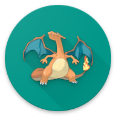

<p align="center">
  
</p>

# PokeShake

A REST API for retrieving a Pokemon shakespearean description.

An example using `curl`

```sh
$ curl http://localhost:5000/pokemon/charizard
```
```json
{
  "name": "charizard",
  "description": "Charizard flies 'round the sky in search of powerful opponents. 't breathes fire of such most wondrous heat yond 't melts aught. However,  't nev'r turns its fiery breath on any opponent weaker than itself."
}
```

## Getting Started

These instructions will get you a copy of the project up and running on your local machine for development and testing purposes.

In order to build, test and run this project the following dependencies need to be fulfilled:
* **Docker**
* **.NET Core SDK 3.1.0**

This document also assumes that `git`, `dotnet` and `docker` are part of your `PATH` so that they are considered valid commands when entered in a shell. 

You can double check that by trying the following commands that should return you an output similar to the below ones.

```sh
git --version
# git version 2.24.0.windows.1
```

```sh
dotnet --version
# 3.1.100
```

```sh
docker --version
#Docker version 19.03.4, build 9013bf5
```

## Build  🔨 

Clone the master branch of this repository into your local system

```sh
git clone https://github.com/p1va/pokeshake.git
```

Move into the newly created directory containing the repository

```sh
cd  pokeshake
```

Build a docker image containing the web api app

```sh
docker build -f src/PokeShake.WebApi/Dockerfile -t pokeshakeapi ...
```

Double check the outcome of the command by looking at the list of images.

An image named `pokeshakeapi` should be there.

```sh
docker image ls
```

## Run 🚀

Create and run a container based on the image we just built with the following command

```sh
docker run -d -p 5000:80 --name mypoke pokeshakeapi
```
Double check the outcome of the command by looking at the list of active containers. 

A container named `mypoke` should be there.

```sh
docker container ls
```

From the list you should also be able to identify the container ID which you can use to view the app logs.

```sh
docker logs --follow <container id>
```

Assuming that the newly created container has `93d060dc0163` as ID, you can view its logs with the following command

```sh
docker logs --follow 93d060dc0163
```

Now that the web api app is running you can try it with the http client of your choice.
In this example i am using `curl`

```sh
curl http://localhost:5000/pokemon/charizard
```

In addition you can visually test the API by browsing to [http://localhost:5000/](http://localhost:5000/) where the Swagger UI is located.


## Test 🔮

Starting at the root directory of the git repository (the one where `PokeShake.sln` file is located)

Restore nuget packages with the following command.

```sh
dotnet restore
```

And then run the tests

```sh
dotnet test
```

> Note that Web API integration tests use port 9999 so tests could fail if that port is already in use. If this is the case just change the port in the `WebApiIntegrationTests` class

## Built With 👨🏻‍💻
* [.NET Core 3.1](https://dotnet.microsoft.com/download) - Development framework
* [AspNet Core 3.1](https://github.com/aspnet/AspNetCore) - Web framework of choice
* [Docker](https://www.docker.com/) - Containers platform
* [Visual Studio 2019](https://visualstudio.microsoft.com/it/vs/?rr=https%3A%2F%2Fwww.google.com%2F) -  IDE
* [VSCode](https://code.visualstudio.com/) - IDE

## Acknowledgments 💪🏼

* [Best-README-Template](https://github.com/othneildrew/Best-README-Template) - A README template
* [Ensure.That](https://github.com/danielwertheim/Ensure.That) - A guard clause library
* [FluentAssertions](https://fluentassertions.com/) - An extension methods libraries for tests assertions
* [FunTranslations API](https://funtranslations.com/api/shakespeare) - An API for unusual text translations
* [Moq4](https://github.com/Moq/moq4) - A mocking library for easier testing
* [Newtonsoft.Json](https://github.com/JamesNK/Newtonsoft.Json) - A JSON serialization/deserialization library
* [PokeAPI](https://pokeapi.co) - An API for retrieving pokemon info
* [Swashbuckle.AspNetCore](https://github.com/domaindrivendev/Swashbuckle.AspNetCore) - A Swagger implementation for AspNet Core
* [xUnit](https://github.com/xunit/xunit) - A test framework
